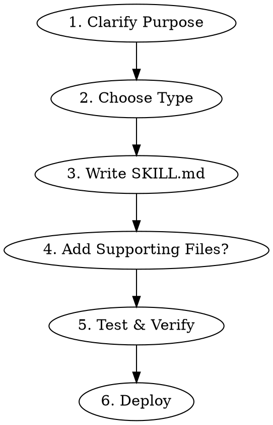

# Skill Creator

Create production-ready Claude Code skills following Anthropic's official best practices and the Agent Skills open standard.

## Process



### 1. Clarify Purpose

Ask before writing:
- **What task** does this skill automate or guide?
- **When triggered** - what does the user say or do?
- **Scope** - one focused purpose (not a "super skill")
- **Reusable?** If one-off, put in CLAUDE.md instead

### 2. Choose Type

| Type | When | Example |
|------|------|---------|
| **Technique** | Step-by-step method | TDD, debugging workflow |
| **Pattern** | Mental model / approach | Code review checklist |
| **Reference** | API docs, syntax guide | Library documentation |
| **Automation** | Execute commands/scripts | Deploy, build, test |

### 3. Write SKILL.md

#### Frontmatter Rules (STRICT)

```yaml
---
name: kebab-case-name
description: Use when [specific triggering conditions]. Mention symptoms and situations.
---
```

**name constraints:**
- Max 64 characters
- Lowercase letters, numbers, hyphens ONLY
- No special chars, no "anthropic" or "claude" reserved words

**description constraints:**
- Max 1024 characters (aim for <500)
- Start with "Use when..." (triggering conditions only)
- Third person voice
- NEVER summarize the skill's workflow in description
- Include specific trigger phrases users would say

**Why no workflow in description:** Claude reads description to decide whether to load the skill. If description summarizes the workflow, Claude may follow the description shortcut instead of reading the full skill body.

#### Body Structure

```markdown
# Skill Name

## Overview
Core principle in 1-2 sentences. What is this and why use it.

## When to Use
- Symptom/situation bullets
- When NOT to use

## [Core Content]
Main instructions, steps, patterns.
Use numbered steps for sequential processes.
Use tables for reference/comparison.

## Quick Reference
Scannable table or bullets for common operations.

## Common Mistakes
What goes wrong + how to fix.
```

#### Content Guidelines

**DO:**
- Use active, directive language ("Run X", "Check Y")
- Break complex tasks into numbered steps
- Include 1 excellent example (not multi-language)
- Add conditional logic: "If X, also do Y"
- Use consistent terminology throughout
- Cross-reference other skills by name: `**REQUIRED:** Use superpowers:skill-name`

**DON'T:**
- Over-explain what Claude already knows
- Include time-sensitive information
- Hardcode API keys or secrets
- Write narrative stories ("In session X, we found...")
- Use generic labels (step1, helper2)
- Force-load other skills with `@` syntax (burns context)

### 4. Supporting Files

**Keep inline** (<50 lines): Principles, code patterns, short examples.

**Separate file when:**
- Heavy reference (100+ lines) - API docs, schemas
- Reusable scripts/tools
- Templates users fill in

```
my-skill/
  SKILL.md              # Required - main instructions
  templates/            # Optional - output templates
  scripts/              # Optional - executable tools
  examples/             # Optional - sample outputs
  reference.md          # Optional - heavy docs
```

### 5. Test & Verify

Before deploying, verify:

- [ ] Frontmatter valid (name: kebab-case, description: starts with "Use when")
- [ ] Description <1024 chars, no workflow summary
- [ ] Body <500 lines
- [ ] Try trigger phrases - does Claude invoke it?
- [ ] Run through the skill's workflow - instructions clear?
- [ ] No missing steps or ambiguous language
- [ ] Referenced files exist in correct locations

**Test with different prompts:**
```
# Should trigger:
"Create a new skill for X"
"Help me build a skill"

# Should NOT trigger:
"What is a skill?"
"List my skills"
```

### 6. Deploy

**Personal skill:**
```bash
~/.claude/skills/my-skill/SKILL.md
```

**Project skill (shared with team):**
```bash
.claude/skills/my-skill/SKILL.md
# Commit and push to repo
```

## Frontmatter Options Reference

| Field | Required | Description |
|-------|----------|-------------|
| `name` | Yes | Kebab-case identifier, max 64 chars |
| `description` | Yes | Triggering conditions, max 1024 chars |
| `disable-model-invocation` | No | `true` = only user can invoke via `/name` |
| `user-invocable` | No | `false` = only Claude can invoke automatically |
| `allowed-tools` | No | Restrict tools: `Read, Grep, Glob` |
| `context` | No | `fork` = run in separate context |

## Search Optimization (CSO)

Future Claude needs to FIND your skill. Optimize for discovery:

1. **Description** - concrete triggers, symptoms, situations
2. **Keywords** - error messages, tool names, symptoms throughout body
3. **Naming** - verb-first, active voice: `creating-skills` not `skill-creation`
4. **Synonyms** - cover variations: "timeout/hang/freeze", "cleanup/teardown"

## Common Mistakes

| Mistake | Fix |
|---------|-----|
| Description summarizes workflow | Description = ONLY when to trigger |
| "Super skill" doing everything | One skill = one focused purpose |
| Multi-language examples | One excellent example, right language |
| Narrative storytelling | Directive instructions, not stories |
| Skipping test | Always test with real trigger phrases |
| Vague trigger: "for testing" | Specific: "Use when tests have race conditions" |
| Name with special chars | Lowercase, numbers, hyphens only |
